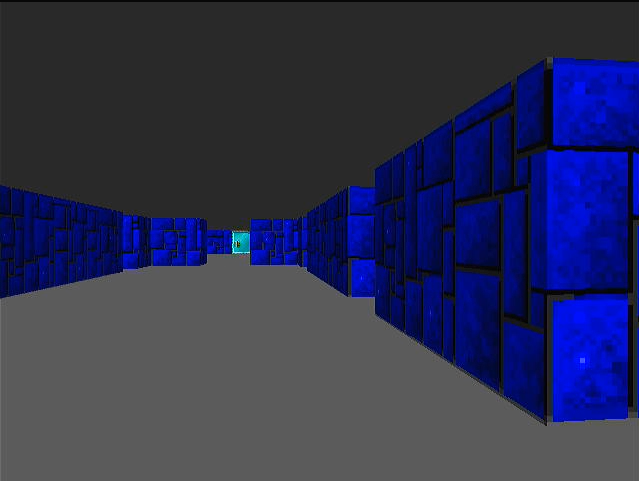

# uefimaze

Bare metal bootable UEFI maze "game".

## Building

To build with [bflat](https://flattened.net):

1. `cd src`
2. For x64: `bflat build --os:uefi --stdlib:zero -o:bootx64.efi` (if you're crosscompiling arm64, also add `--arch:x64`)
   For arm64: `bflat build --os:uefi --stdlib:zero -o:bootaa64.efi` (if you're crosscompiling from x64, also add `--arch:arm64`)

Then copy the generated *.efi file to the `efi/boot` directory of a FAT32 formatted volume. Boot the machine with it. You might need to disable secure boot. If you're targeting Raspberry Pi, also download a [UEFI firmware](https://github.com/pftf/RPi4/releases/tag/v1.35) and extract the ZIP to the root of the FAT32 volume.
